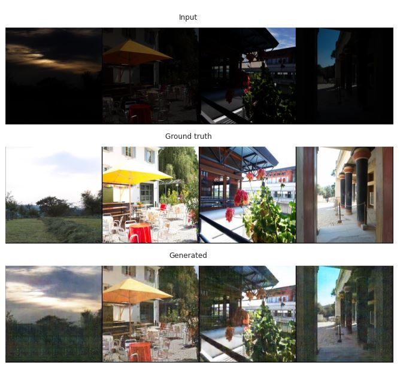

# pix2pix
## Image2Image generation with pix2pix

## Генерация изображений с помощью pix2pix

**1.** В первой части проекта была решена задача восстановления фасадов зданий по изображению его меток. На основании [статьи](https://arxiv.org/pdf/1611.07004.pdf) была написана модель pix2pix. Параметры модели также были взяты из статьи. Результаты на новых изображениях можно видеть ниже.

Видно, что модель правильно генерирует окна, балконы, двери и другие элементы фасадов. Однако, при генерации заднего фона и крыши у модели возникают некоторые проблемы. Дообучение не помогло, так как модель переобучается, возможно поможет экспериментирование с архитектурой и параметрами модели.

По [ссылке](https://drive.google.com/file/d/1IgC0q6yi4pxKj8cAa7IDaY4Ze8x6sgym/view?usp=sharing) можно скачать веса для генератора и дискриминатора для решения задачи восстановления фасадов. 

**2.** Во второй части необходимо было выбрать новую задачу и решить ее с помощью написанной модели. Я выбрала задачу улучшения качества и восстановления информации сильно затемненных фото. На картинках ниже представлены результаты работы модели.

Модель обучилась хорошо и позволяет улучшать качество затемненных фотографий. Стали видны детали, которые на исходных фотографиях не разобрать невооруженным глазом.
Веса модели для этой задачи можно скачать [здесь](https://drive.google.com/file/d/1-6SVuwMmZkHgLB9nF3-kng4509S80-3a/view?usp=sharing).

Если файл блокнота .ipynb не открывается на github, его можно посмотреть [тут](https://colab.research.google.com/drive/1BSyBz6s9Al2i7DNh2dVZTvJtUww16Wct?usp=sharing).

Больше примеров с результатами работы модели можно найти в папке */images*.
