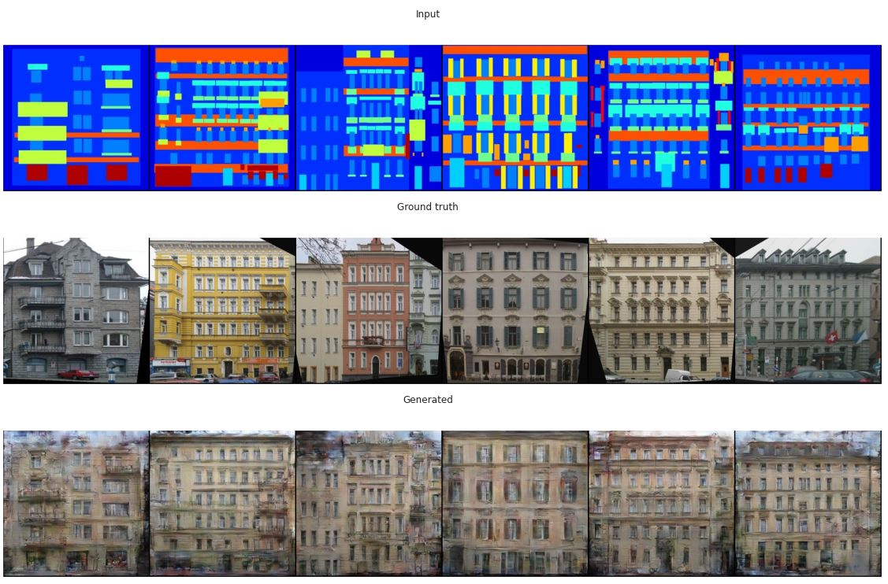
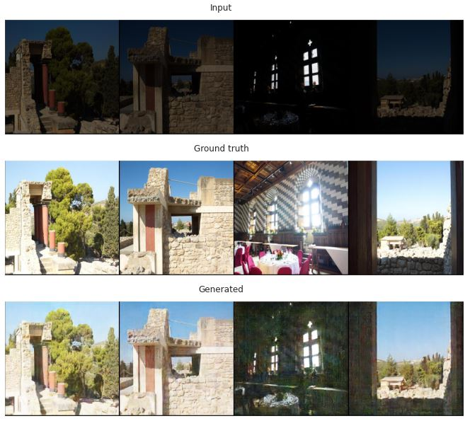

# pix2pix
## Image2Image generation with pix2pix

## Генерация изображений с помощью pix2pix

В первой части проекта была решена задача восстановления фасадов зданий по изображению его меток. Была написана модель pix2pix. Результаты работы модели на новых изображениях можно видеть ниже.

Во второй части необходимо было выбрать новую задачу и решить ее с помощью написанной модели. Я выбрала задачу улучшения качества и восстановления информации сильно затемненных фото. На картинках ниже представлены результаты работы модели.

